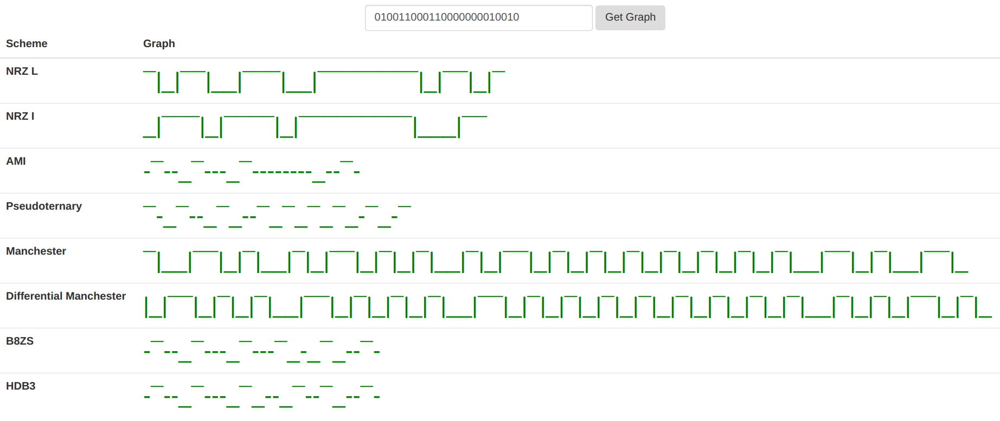

# Assignment - Chapter #5: Signal Encoding

## Introduction

This is a submission of an assignment for Data Communication and Networking - CS 5290. The instructions are available on Instructions section. This assignment is done on two different languages - C++ and PHP. 

## Team Members

* Arjun Malik ( arjunm@bgsu.edu ) 
* Mantek Singh Bhatiya ( mantekb@bgsu.edu) 
* Sagar Sharma ( ssharm@bgsu.edu ) 

## Instructor
* Dr. Robert Green

## Instructions

For this assignment, you will write a program to implement an encoder that receives binary data and produces the encoded data as a digital signal using the digital encoding techniques listed below. Assume that the reference value is negative for all the encoding techniques (same as in Figure 5.2). The result of running your program should be a digital waveform. You can produce this output using either text with a + sign indicating a positive signal, a _ indicating no signal, and a – sign indicating a negative signal. If your program produces this output in graphical form, you may receive bonus points. You may work in a group of 2–3 students but, if you work in a group, I will expect you to turn in a higher quality assignment.

## Running the program
Since the assignment is done in two ways, the process of running and getting the output is shown for both ones:

#### PHP
1. Clone this repo inside the 'htdocs' folder if you're running on XAMPP or inside the 'WWW' folder if you're running on WAMPP. If you're using any other software, refer to that software's specifics to run a PHP project.
2. Start the server and the demo would be available on http://localhost/CS4290_SP2017_A3_SHARMA. 
3. Enter the input bits (a combination of 0's and 1's) and hit Get Graph.
4. That's it. You can see 6 different encoding schemes and 2 different scrambling techniques.

### Representations
1. Positive Voltage is represented by a Macron( ¯ )
2. Zero Voltage is represented by a Hyphen/Minus sign( - )
3. Negitive Volatge is represented by an Underscore( _ )
4. Transitions are represented by a Vertical Line/OR operator( | )

<b>The working demo of this assignment on PHP can be accessed from http://signal.sagarsharma.com.np</b>

#### C++
1. Clone this repo to any working location you like.
2. Run the file source.cpp with any IDE of your preference that works for C++ codes.
3. Enter the number of input bits that you're going to enter. Then enter the input bits one at a time.
4. On the next prompt, enter 'Y' if the input bits are correct. Else, hit any other key to return to step 3.
5. You'll see 6 different encoding schemes. If you want to run scramber, hit 'Y'. Else, hit any other key which will terminate the program. If you hit 'Y', you'll see two different scrambling techniques.

### Representations
1. Positive Voltage is shown by a Circumflex Accent/power operator( ^ )
2. Zero Voltage is represented by a Hyphen/Minus sign( - )
3. Negitive Volatge is represented by an Underscore( _ )
4. Transitions are represented by a Vertical Line/OR operater( | )

### Attempt for Bonus Points
* A GUI-based Web Application
* Graphical output of the waveforms
* Assignment hosted on web server; live version of the assignment accessible online.
* Submission on two different languages - PHP and C++
* Check done for input bits - only 0's and 1's allowed in the Web Application.

### Output
Following shows one test case for input bits - 010011000110000000010010

